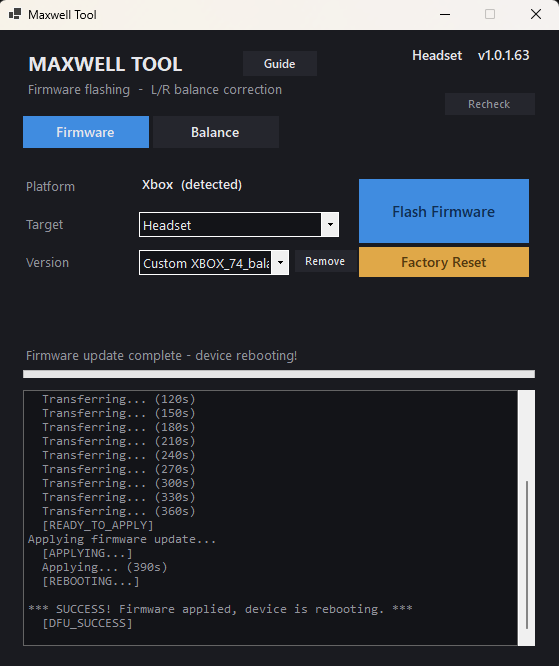

# Audeze Maxwell Tool

A self-contained Windows tool for the Audeze Maxwell headset that does two things:

1. **Fixes the L/R audio balance** — permanently, baked into the headset's own firmware, so the fix works everywhere (iPhone, console, PC) with no software running.
2. **Flashes / downgrades firmware** — any version, even though Audeze disabled the official rollback feature.

---

## How to download — start here

You do **not** need to be technical to use this tool.

**Do not** use the green **`Code`** button or **Download ZIP** at the top of this page — that downloads the source code, not the working app.

To get the tool:

1. Click **Releases** on the right-hand side of this page.
2. Under the latest version, click the **`.zip`** file to download it.
3. **Extract** the downloaded zip — right-click it and choose *Extract All*.
4. Open the extracted folder and double-click **`MaxwellTool.exe`**.

Keep everything in that folder together — the `.exe` needs the other files beside it to run.

---

**Why this exists.** Firmware v1.0.1.74 left some Maxwell units with an audible left/right loudness imbalance, and there has been no firmware update in roughly two years. This tool lets you measure your headset's balance, dial in a correction by ear, and bake it into a custom firmware that survives reboots and source changes.

> 📖 Want the deep technical story — *why* the imbalance exists and how the firmware works internally? See the companion research repo: **[maxwell-firmware-research](https://github.com/kats1123/maxwell-firmware-research)**.

---

## Requirements

- Windows 10 / 11, 64-bit
- The Maxwell headset. A **USB-C cable** is required to flash the headset's firmware; balance read/apply work over the cable *or* the wireless dongle.
- Nothing else — `MaxwellTool.exe` is fully self-contained. No .NET runtime, no Audeze app needed.

Keep the headset charged above ~50% before flashing.

---

## The window at a glance

When you open **`MaxwellTool.exe`** you get two tabs:

- **Firmware** — flash or downgrade firmware, and factory-reset the headset.
- **Balance** — read, test and bake in an L/R balance correction.

The **top-right corner** shows the firmware version of what is connected — the headset, and (when you are connected through the wireless dongle) the dongle as well. Click **Recheck** to refresh it. The **Guide** button next to the title opens these instructions inside the tool at any time.

---

## Fixing the L/R balance — step by step

This is the main job of the tool. The result is a custom firmware with your correction built in.

**1. Connect the headset to the PC with the USB-C cable.** Close the Audeze app if it is open. Open `MaxwellTool.exe`.

**2. Go to the Balance tab.** It reads the headset automatically and shows the current Left and Right values. **Read Balance** re-reads any time.

**3. Adjust the Left and Right numbers.**
   - Lower the channel that sounds louder, or raise the one that sounds quieter.
   - Move in small steps (1–3 at a time).
   - **The maximum is 150 by design. Do not try to go higher** — large gain values can overdrive and physically damage a driver.

**4. Click `Apply (live test)`.** The values take effect on the headset immediately. Listen to something with clear centred audio (mono track, vocal) and judge the balance. Repeat steps 3–4 until it sounds centred.

   `Apply` writes the values into the headset and **saves them** — they persist through power-offs and everyday use, on any device (phone, console, PC), because they live in the headset itself. They are only cleared by a **factory reset** or a **fully drained battery**. Step 5 bakes them into the firmware so even a factory reset can't clear them — the permanent form.

**5. When it sounds right, click `Make Custom Firmware`.** The tool bakes your L/R values into a flashable v1.0.1.74 firmware, detects Xbox vs PlayStation automatically, and switches you to the **Firmware tab** with the new file already selected.

**6. Click `Flash Firmware`.** If your headset is already on v1.0.1.74, the tool stops you and tells you to flash stock v1.0.1.63 first (you cannot re-flash the version already installed) — do that, then flash the custom firmware.

**7. Run the factory reset.** After the custom flash the tool checks the headset and — because the baked-in values are not active until a reset — prompts you with a **Run Factory Reset** button. Click it. This step is required: flashing only updates the firmware *code*; the factory-reset routine is what writes the new balance into the headset's settings.

Once done, the fix lives in the headset. It works on a phone, a console, anything — with nothing connected to a PC. The tool checks your connection at every step and will stop you before a common mistake (dongle still plugged in, wrong version, skipped reset) costs you a 10-minute flash.

---

## Flashing firmware

The Firmware tab also works as a plain firmware flasher / downgrader.

1. Pick **Target** (Dongle / Headset) and **Version**. The **Platform** (Xbox / PlayStation) is detected from the connected device automatically.
2. Click **Flash Firmware** and follow the on-screen instructions.

### Headset flash — get the headset into the right state first

This is the single biggest factor in whether a headset flash succeeds:

1. **Unplug the wireless dongle** from the PC.
2. **Turn the headset fully off** — no lights on it at all. (If you see *any* light while the USB-C cable is unplugged, it is **not** off.)
3. With the headset off, **wait about 5 seconds**.
4. **Plug the USB-C cable** into the headset.

Close the Audeze app before flashing. In this "connected but off" state the tool's top-right corner shows the headset's firmware version — once you see it, the headset is connected and ready to flash. (That display is the connection check; you don't need to look for the headset in the Audeze app.)

If a flash fails, put the headset back into that state: unplug the USB-C cable, wait 5–10 seconds (headset still off), plug it back in, then retry.

**Dongle flash:** plug the dongle into the PC, power the headset on (wirelessly paired), close the Audeze app.

A flash takes roughly **5–10 minutes**. Do not disconnect anything until it finishes. The tool checks the connection before it starts and will stop you if, for example, the dongle is still plugged in while you are flashing the headset, or you are trying to re-flash the version already installed.

A slow transfer is **normal** — do not panic and do not unplug. Here is a flash that ran past six minutes and finished fine:



### The same-version rule

The flasher cannot re-flash the version that is already installed — it needs a version *change*. So:

- To install a **custom v1.0.1.74** onto a headset already on v1.0.1.74:
  **first flash stock v1.0.1.63**, then flash the custom v1.0.1.74.
- The top-right version display tells you which case you are in.

This is why a custom-firmware install is sometimes a two-flash process.

---

## Factory reset

The **Factory Reset** button (on both tabs) restores the headset to factory defaults. It uses the same mechanism as the Audeze app's reset.

Use it:

- **After flashing a custom firmware** — required, so the baked-in balance applies.
- Any time you want to clear the headset's settings (EQ presets, sidetone, etc.).

The headset reboots and re-connects on its own, about 15-20 seconds (the reset restarts the headset twice). If for any reason the button does not reset it, you can also factory-reset from the Audeze app.

---

## Troubleshooting

| Problem | Solution |
|---------|----------|
| Top-right or Read shows nothing | Make sure the headset (or the dongle) is connected and the Audeze app is closed, then click **Recheck** / **Read Balance**. |
| "Could not connect to device" | Headset flash: get the headset into the off-then-cabled state above. Dongle flash: headset must be powered on and paired. Close the Audeze app. |
| Stuck on "Transferring..." | Normal — a flash can take up to ~10 minutes. Be patient, do not unplug. |
| Status `FAIL/TIMEOUT`, or a flash won't start | Unplug the USB-C cable, wait 5–10 seconds with the headset off, plug it back in, and retry — see the headset-flash steps above. |
| Device shows as a generic "USB Device" | Device Manager → right-click the device → Update driver → "Let me pick" → **USB Composite Device**. |

---

## How it works

The tool talks to the Maxwell's Airoha AB1568 chip over USB HID using the Airoha **RACE** protocol:

- **Balance read / apply** use RACE gain commands — these relay through the dongle, so balance works over the USB-C cable or the wireless dongle.
- **Firmware version** is read off the headset's flash over the cable; over the dongle, the SDK reports both the dongle and the headset behind it.
- **Make Custom Firmware** decompresses a stock v1.0.1.74 image, patches the factory-default balance values, recomputes every SHA-256 integrity hash, and recompresses it into a valid flashable image.
- **Flash** and **Factory Reset** use the bundled `AirohaHidCoreLib.dll` (the same SDK the Audeze app uses).

The Maxwell uses dual-bank firmware: a successful flash writes the inactive bank and the device swaps banks on reboot, so a power loss mid-flash should leave you on the previous firmware rather than bricked. (Not a guarantee.)

---

## Build from source

Requires the .NET 8 SDK.

```
cd src
dotnet publish MaxwellTool.csproj -c Release -r win-x64
```

The single-file `MaxwellTool.exe` lands in `src/bin/Release/net8.0-windows/win-x64/publish/`. Run it from a folder that also contains the bundled native DLLs (`AirohaHidCoreLib.dll`, `AirohaPeqLibrary.dll`, the `libgcc`/`libstdc++`/`libwinpthread` runtime DLLs) and the `firmware/` folder. The stock firmware images used by *Make Custom Firmware* are embedded in the executable.

---

## Credits

- RACE protocol research informed by [auracast-research/race-toolkit](https://github.com/auracast-research/race-toolkit) and [ramikg/airoha-firmware-parser](https://github.com/ramikg/airoha-firmware-parser).
- SDK function signatures reverse-engineered from the Audeze app binary.
- Built for the Audeze Maxwell community.

## Disclaimer

Use at your own risk. Firmware flashing can brick a device if interrupted or if the firmware files are corrupted. Never set balance values above 150 — high gain can damage a driver. This project is not affiliated with, endorsed by, or sponsored by Audeze LLC. "Audeze" and "Maxwell" are trademarks of their respective owners.
